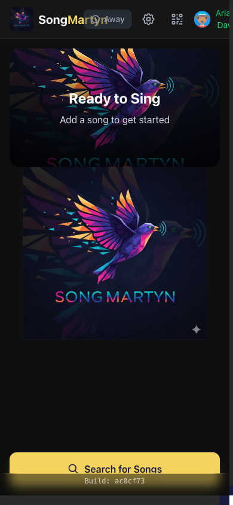
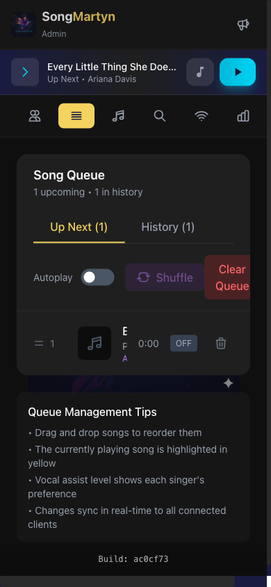
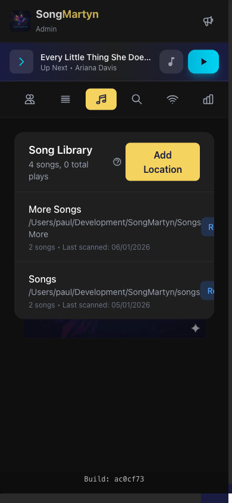
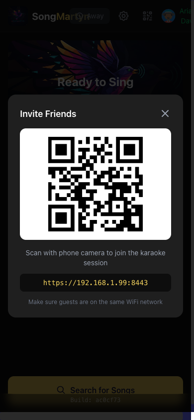
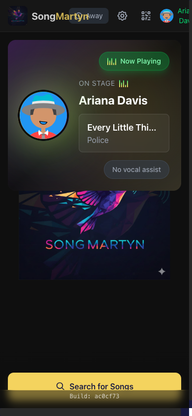

<p align="center">
  
</p>

<h1 align="center">SongMartyn</h1>

<p align="center">
  <strong>The ultimate self-hosted karaoke party system</strong><br>
  Let guests queue songs from their phones while you focus on the fun.
</p>

<p align="center">
  <a href="#features">Features</a> •
  <a href="#how-it-works">How It Works</a> •
  <a href="#screenshots">Screenshots</a> •
  <a href="#quick-start">Quick Start</a> •
  <a href="#requirements">Requirements</a>
</p>

---

## Why SongMartyn?

**No more passing around song books.** No more waiting in line at a machine. No more expensive per-song fees.

SongMartyn transforms any computer with a TV into a professional karaoke setup. Guests scan a QR code to browse your library and queue songs from their own phones — no app download required.

**Your music. Your network. Your control.**

---

## Features

### For Your Guests

- **Instant Access** — Scan QR code to join, no app needed
- **Browse & Search** — Find songs by title or artist
- **Queue Songs** — Add to the shared queue with one tap
- **Personal Avatars** — Customize your identity with unique avatars
- **Vocal Assist Levels** — Choose how much backing vocal support you want

### For Hosts & DJs

- **Real-Time Admin Panel** — Control everything from any device
- **User Management** — Promote admins, kick trolls, block repeat offenders
- **Queue Control** — Reorder, shuffle, skip, or clear the queue
- **Background Music** — Auto-play music when the queue is empty
- **Fair Rotation** — Ensure everyone gets a turn
- **AFK Detection** — Bump absent singers to the end

### Technical Highlights

- **Bring Your Own Library** — MP4, MKV, MP3, CDG+MP3, and more
- **YouTube Integration** — Search and queue YouTube karaoke videos (API key required)
- **Secure by Default** — HTTPS encryption, PIN-protected admin access
- **Pitch & Tempo Control** — Adjust key and speed on the fly
- **Scrolling Ticker** — Show upcoming singers on screen
- **Custom Holding Screen** — Display your message between songs

---

## How It Works

```
┌─────────────────────────────────────────────────────────────┐
│                      YOUR LOCAL NETWORK                      │
│                                                              │
│    📱 Guests              📱 Admin              🖥️ Server    │
│    scan QR code           controls              runs         │
│    queue songs            the show              SongMartyn   │
│         │                    │                      │        │
│         └────────────────────┴──────────────────────┘        │
│                              │                               │
│                              ▼                               │
│                     📺 TV / Projector                        │
│                     displays karaoke                         │
│                                                              │
└─────────────────────────────────────────────────────────────┘
```

1. **Start SongMartyn** on a computer connected to your TV
2. **Guests scan the QR code** shown on screen
3. **Everyone browses and queues** songs from their phones
4. **Songs play automatically** with countdown timers between singers
5. **You control the party** from the admin panel

---

## Screenshots

<table>
  <tr>
    <td align="center">
      <br>
      <em>Guest Home Screen</em>
    </td>
    <td align="center">
      <br>
      <em>Admin Queue Management</em>
    </td>
    <td align="center">
      <br>
      <em>Library Management</em>
    </td>
  </tr>
  <tr>
    <td align="center">
      <br>
      <em>QR Code Join</em>
    </td>
    <td align="center">
      <br>
      <em>User Settings & Avatar</em>
    </td>
    <td align="center">
      <br>
      <em>Now Playing View</em>
    </td>
  </tr>
</table>

---

## Quick Start

### 1. Install mpv (media player)

**macOS:**
```bash
brew install mpv
```

**Ubuntu/Debian:**
```bash
sudo apt install mpv
```

**Windows:** Download from [mpv.io](https://mpv.io/installation/)

### 2. Download & Run

```bash
# Clone the repository
git clone https://github.com/yourusername/songmartyn.git
cd songmartyn

# Build backend
cd backend && go build -o songmartyn ./cmd/songmartyn

# Build frontend
cd ../frontend && npm install && npm run build
cp -r dist ../backend/

# Generate TLS certificate
cd ../backend && mkdir -p certs
openssl req -x509 -newkey rsa:2048 -keyout certs/key.pem -out certs/cert.pem -days 365 -nodes -subj "/CN=SongMartyn"

# Run!
./songmartyn
```

### 3. Open Admin Panel

Navigate to `https://localhost:8443/admin` and add your music folders.

---

## Requirements

| Component | Requirement |
|-----------|-------------|
| **OS** | Windows 10+, macOS 10.15+, or Linux |
| **Player** | mpv media player |
| **Network** | All devices on same WiFi network |
| **Display** | Computer + TV/Projector |

### Supported Formats

**Video:** MP4, MKV, WebM, AVI
**Audio:** MP3, M4A, WAV, FLAC, OGG
**Karaoke:** CDG+MP3 pairs

---

## Configuration

Create a `.env` file for custom settings:

```env
HTTPS_PORT=8443          # HTTPS port (default: 8443)
ADMIN_PIN=               # Set for remote admin access
YOUTUBE_API_KEY=         # Enable YouTube search
BGM_ENABLED=true         # Background music when idle
```

See [.env.example](backend/.env.example) for all options.

---

## Roadmap

- [ ] Custom venue branding (logo, colors)
- [ ] Lyrics display overlay
- [ ] Audio separation (remove vocals from any song)
- [ ] Analytics dashboard
- [ ] Chromecast support

---

## Support

- **Issues:** [GitHub Issues](https://github.com/yourusername/songmartyn/issues)
- **Discussions:** [GitHub Discussions](https://github.com/yourusername/songmartyn/discussions)

---

## License

Source Available — See [LICENSE](LICENSE) for details.

Personal use permitted. Commercial use requires a license.

---

<p align="center">
  <strong>SongMartyn</strong> — Making karaoke nights unforgettable.
</p>
